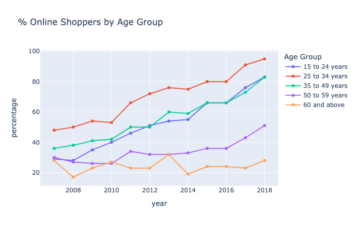
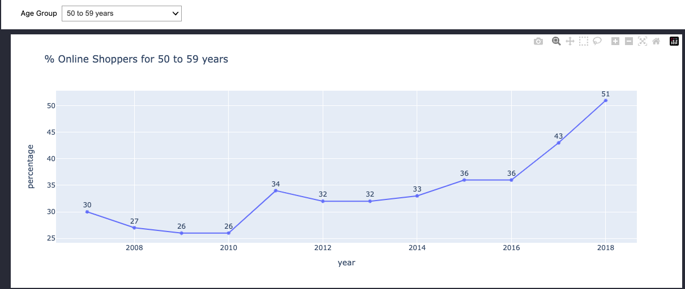

# Singapore: Online Shoppers by Age Group 2007-2018

Data source: [data.gov.sg](https://beta.data.gov.sg/collections/242/view)

The notebook aims to provide basic visualisation using the `plotly.express` to present the percentage of online shoppers over the years and examine the trends. 

Dataset is clean with no missing data. However, age group of `less than 7` and `7 to 14 years` were filtered considering that they are minors. 

From the chart above, we noted the following observations. 
- 25 to 34 years have the highest proportion of online shoppers at 95% in 2018. 15 to 24 years and 35 to 39 years followed closely behind at 83% in 2018. 
- An increase in percentage of 50 to 59 years was observed between 2016 and 2018. 
- A worrying trend of those 60 and above where proportion of online shoppers remained largely unchanged. One possible reason can be the rate of technology adoption is slower for this age group. 

An attempt was made to allow interaction with charts using `ipywidgets` where selecting different age group will plot the line graph as follows. 

