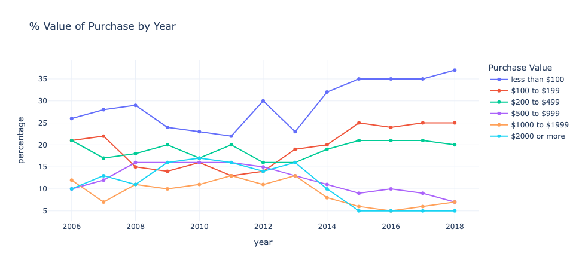

# [9 Jul 2024] Online Shoppers Purchase Value 2007 - 2008 in Singapore 

Data source: [data.gov.sg](https://beta.data.gov.sg/collections/242/view)

This simple line chart shows the percentage of online purchases based on value from 2007 - 2008. Library used: `plotly.express` with a slight change to the default template of the chart to reflect a white background. 

From the chart above, the highest percentage of online purchases were valued less than $100 in year 2018. 

As shown in the chart, purchases with value more than **$1,000** saw a dip in 2013. One of the possible reasons could be consumers' concerns over the quality and legitimacy of products and/or services sold on online platforms (ref: [Alibaba spent US$161m fighting fakes since 2013](https://www.businesstimes.com.sg/startups-tech/technology/alibaba-spent-us161m-fighting-fakes-2013)). It could also be due to consumers' preference to experience the product in-stores before pricing such high valued products/services.