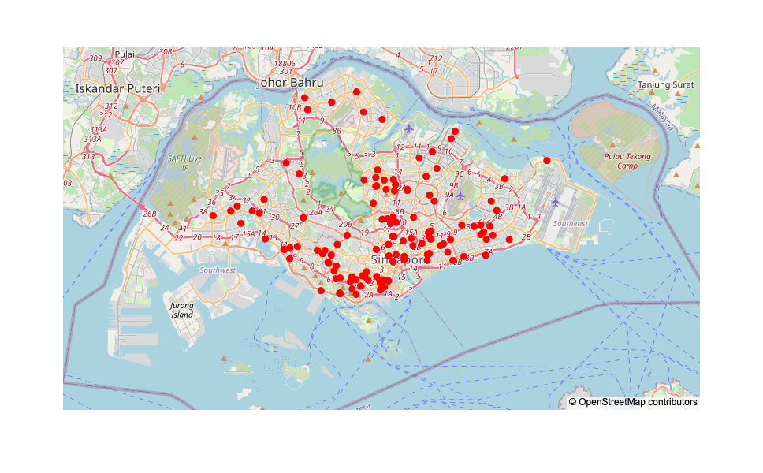
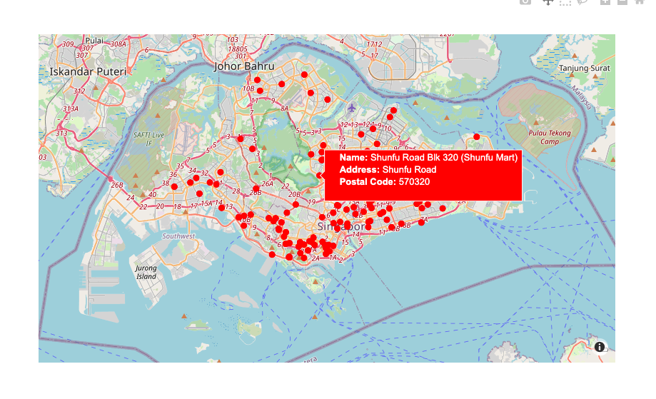

# Exploration of Plotly Map using GeoJSON file 

Objective: 🎯
- Using python open source libraries such as `plotly.express` and `pandas` to plot locations of hawker centres in Singapore. 
- Hover options can be used to include more details about the hawker center. 
- Data of Singapore hawker centres taken from [data.gov.sg](https://data.gov.sg/) 

## Learning Outcomes ⭐️

### 1. Converting html table strings in GeoJSON dataframe column into usable features in Pandas

```python
for _, row in df.iterrows():
    html_table = row['Description']
    temp_df = pd.read_html(html_table)[0]
    features = temp_df.set_index('Attributes')['Attributes.1'].to_dict()
    features['Name'] = row['Name']
    parsed_data.append(features)
```

### 2. Converting GeoJSON data into Pandas dataframe

```python 
import pandas as pd 
import geopandas as gpd

gdf = gpd.read_file(file_path)

# Extract latitude and longitude from geometry column 
gdf['lon'] = gdf.geometry.x
gdf['lat'] = gdf.geometry.y

# Convert to pandas dataframe
df = gdf.drop(columns='geometry')
```

### 3. Ploting geographical map with OpenStreetMap template using plotly.express

- **Map with all hawkers centre as red circle**


- **Interactive map with hovering option showing details of hawker center**
