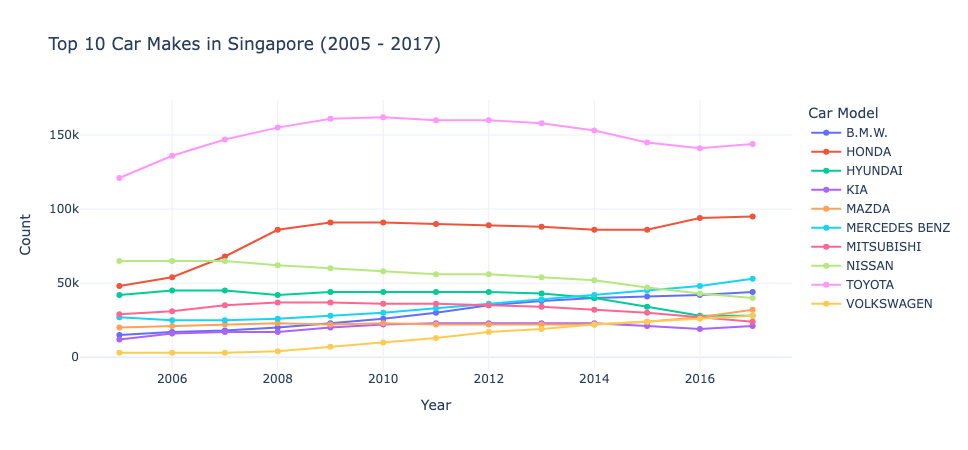
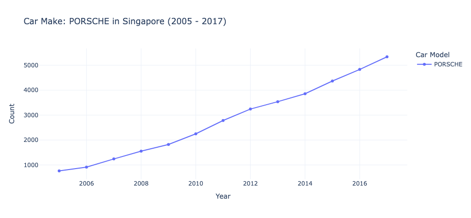
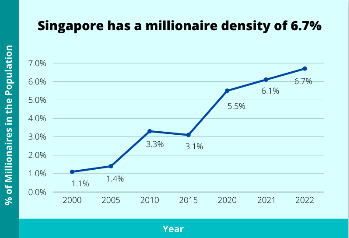
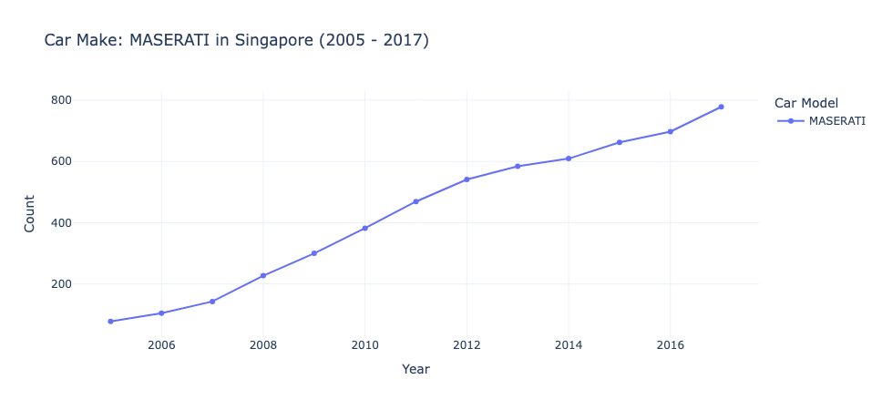
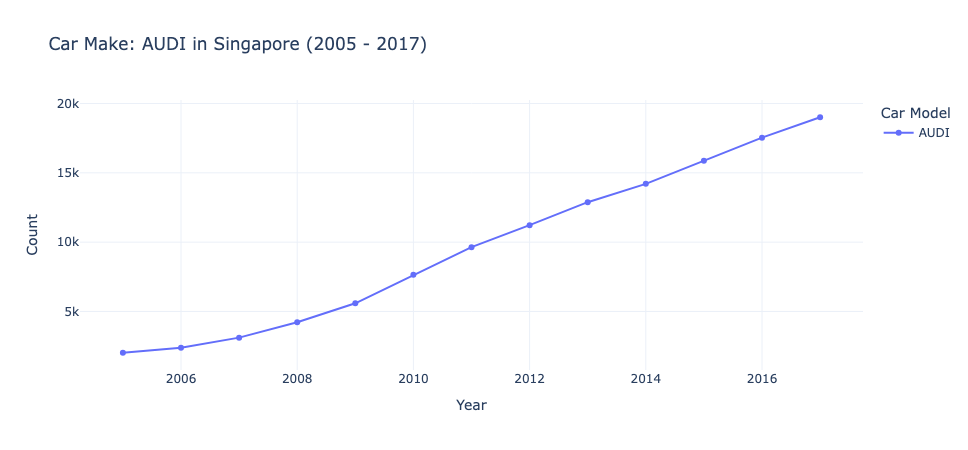

# Exploration of Common Car Make in Singapore

Objective: 🎯
- Using python open source libraries such as `plotly.express` and `pandas` to explore some of the common car make and trends in Singapore during 2005 - 2017. 
- Data from LTA taken from [data.gov.sg](https://data.gov.sg/) 

## Findings 📊

#### 1 - Top 10 common car make in Singapore 

By plotting the line chart, we observe the trends of the popular car make in Singapore. 

**Toyota**
- Steadily decreasing since 2010. 
- Perceived as [one of the most reliable Japanese brand](https://kaizenaire.com/sg/top-10-most-reliable-car-brands-for-singaporean-drivers/#:~:text=According%20to%20their%20latest%20report,Porsche%2C%20BMW%2C%20and%20Kia.) in Singapore.
- Given the high cost of car ownership in Singapore, it's natural for consumers to seek brands that are reknown for it's reliability and low maintenance cost for the next 10 (or less) years before the certificate of entitlement (COE) expires. 
- With that in mind, demand for Toyota and Honda are the highest in Singapore. 
- But supplier could leverage on this competitve advantage to charge a premium in Singapore. Hence, the cost of a Toyota car have been steadily increasing over the years. The price of Toyota brand new cars come close to Mercedes Benz in recent years. But driving experience of continental car still trumps over commercial Japanese car.

**Honda**
- Observed a spike from around 48k in 2005 to 86k in 2008. Another increase observed from 86k in 2015 to 94k in 2016. 
- One possible reason for the increase in recent years may be a result from public driving center for learners use Honda jazz as their training cars. 
- Honda, similar to Toyota, is known for its reliability, low maintenance and value for money. 
- It's perceived as one of the safer and value for money option for first time owners, small families, and middle-income individuals. 

**Nissan**
- Used to be one of the top 3 most common car make in Singapore in the early years 2005-2006. However, the number decreases from 65k in 2005 to 40k in 2017 (~23% decline). 
- In recent years, it was known that Nissan has been facing financial woes and had to merge with Renault in 1999. There are talks about alliance among Renault, Nissan and Mitsubishi targeted in 2030. [Carlos Ghosn](https://www.drive.com.au/news/is-nissan-really-in-serious-trouble/) who ran both Renault and Nissan during merger fled Japan in 2018 after facing arrest for allegedly misusing company funds. Sales of Nissan cars have been declining especially in one of the most important market - China resulting in 9,000 jobs cut and reduced ownership stake in Mitsubishi. 
- Additionally, Nissan cars have been perceived as increasingly unreliable and appearing less on searches of reliable car brands. From auto-dealers to car instructors, the bad reviews of Nissan car especially in terms of reliability have been popping up. 

**Mercedes Benz**
- One of the luxury car brand in Singapore but was among the top 3 from 2016 to 2017. Numbers have been steadily increasing over the years. 
- Mercedes Benz is perceived as one of the most reliable to own continental cars in Singapore. It's also the go-to option for high income earners as a head-turner and a symbol of wealth and status. 
- Both interior and exterior of the vehicles used high quality materials instead of plastics found in most Japanese and Korean car makers. 
- Driving experience of the Mercedes Benz awed many car lovers. Moreover, it's much more dependable and reliable when compared to other continental luxury car brands. 

**BMW** 
- Another luxury car brand that many individual in Singapore loved. It's among the top 5 in recent years with numbers showing an increasing trend throughout the years. 
- Reasons for the increase is quite similar to Mercedes Benz, with the major reasoning for better driving experience. It's also a symbol of wealth and status among the higher income earners. It's not rare to hear conversations around cars that "Mercedes Benz and BMW are bosses' car brands".

**Other noteworthy brands:**

**Mazda**
- Increasing trend observed from 20k in 2005 to 32k in 2017 (~60% increase). 
- Mazda is increasing popular in Singapore given it's perceived reliability, better driving experience, comparable interior fittings to continental cars and value for money. 

**Volkswagon**
- Increasing trend observed from 3k in 2005 to 28k.
- Mainly due to the lower price and higher PARF value of Volkswagon cars, resulting in lower depreciation. Hence, for cost-consious buyers who looks for continental cars driving experience, Volkswagon becomes more of the more viable choice in recent years.

#### 2 - Other Noteworthy Trends

**PORSCHE**
- Have been increasing over the years (i.e., straight line) - from 763 in 2005 to 5339 in 2017. 
- Easily one of the most expensive car brands to own in Singapore.
- When looking at the millionaire density and the porsche car ownership side by side, there seem to be a correlation between the two.

**MASERATI**
- Steadily increasing over the years. With a showroom opening in 2017 as demand grows, it's one of the cheaper alternative among luxury sports car brands such as Porsche, Ferrari. 

**AUDI**
- Another continental car brand that is popular among the high-middle to high income earners is Audi. A car that prides itself in terms of design and build quality. 
- It has a similar status close to Mercedes Benz and BMW in Singapore. 
- Additionally, Audi has added a new shownroom near Chinatown in 2024 allowing a direct customer service to buyers. The maker is closely linked to popular German car makes such as Porsche and Volkswagon in Singapore. 

#### 3 - About car make in data
Top 5 most common car make in Singapores are: Toyota, Honda, Nissan, Hyundai, and Mercedes Benz. 
Bottom 5 car make in Singapores are: MayBach, Smart, Lada, Mini cooper, Bertone.

Based on intuition, there could be prolems with the data collected given that mini cooper are common in Singapore roads.
Data came from LTA and figures include cars exempted from tax and vehicle quota system. However, it's unclear about the time period of data collection. 

Does the car make only include newly and renewed issued COE cars for that year or all cars in Singapore? Perhaps, there are missing or unaccounted data that were not included in the database. 

